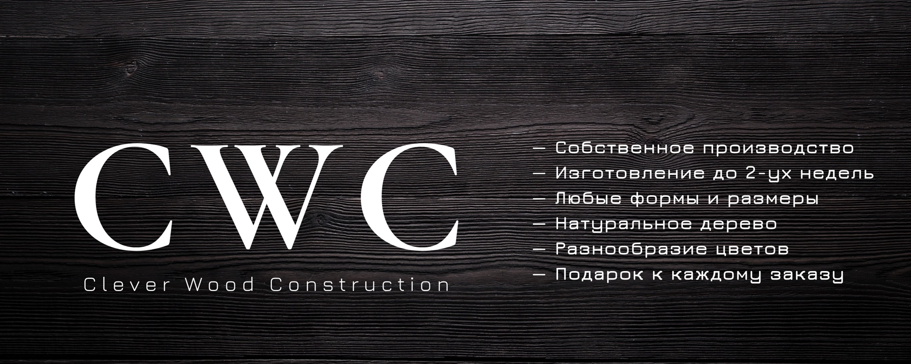

      

# CWCbot для Telegram.
Бот написан для CWC. CLEVER WOOD CONSTRUCTION — столярное производство в Красноярске.

# Технологии
- [Python](https://www.python.org/)
- [aiogram](https://aiogram.dev/)
- [SQLAlchemy](https://www.sqlalchemy.org/)
- [aiosqlite](https://aiosqlite.omnilib.dev/en/stable/api.html)

# Краткое описание
Бот для расчета стоимости изделий из дерева!

Данный бот быстро и точно рассчитывает стоимость ваших проектов, учитывая все необходимые параметры: размер, тип древесины и сложность работы. Бот готов помочь с ответами на популярные вопросы о наших услугах, материалах и процессе изготовления изделий. Бот мгновенно отвечает на ваши вопросы и предоставляет всю необходимую информацию CWC.

# Команды
- /start — запуска бот / меню Бота.
- /cancel — отмена работы калькулятора / отмена действия для пользователя.
- /cwc — админ-панель.
- /cancel_action — отмена действия в админ-панеле.
- /back_step_project — вернуться на один шаг во время взимодействия со вкладкой «Проекты».
- /back_step_underframe — вернуться на один шаг во время взимодействия со вкладкой «Подстолья».

# Инструкция для пользователей
- Калькулятор — бот поможет вам рассчитать примерную стоимость изделия. Также Вы сможете оставить заявку для связи с нами. Финальная цена обговаривается с представителями компании.
- «Цвет дерева» — обзор доступных оттенков изделий.
- «Посмотреть проекты» — ознакомьтесь выполненными проектами CWC.
- «Обратная связь» — telegram CWC.
- «Помощь» — вся необходимая информация по работе с ботом и о CWC.

# Инструкция админ-панель
- /cwc — открыть админ-панель, также сбрасывает машину состояний.
- «Цвета» — редактор таблицы "colors" в БД. Посмотреть, добавить, изменить или удалить изображение с цветами дерева.
- «Проекты» — редактор таблицы "projects" в БД. Посмотреть, добавить, изменить или удалить данные об предыдущих заказах по шаблону. 
- «Калькулятор» — редактор таблиц "materials" и "underframe" в БД. Изменить цену материалов, а также добавить, изменить и удалить информацию о подстольях.
- «Утилиты» — редактор таблицы "utils" в БД. В будущем при расширении функционала, может понадобиться. Сейчас можно изменить изображение подстолья.
